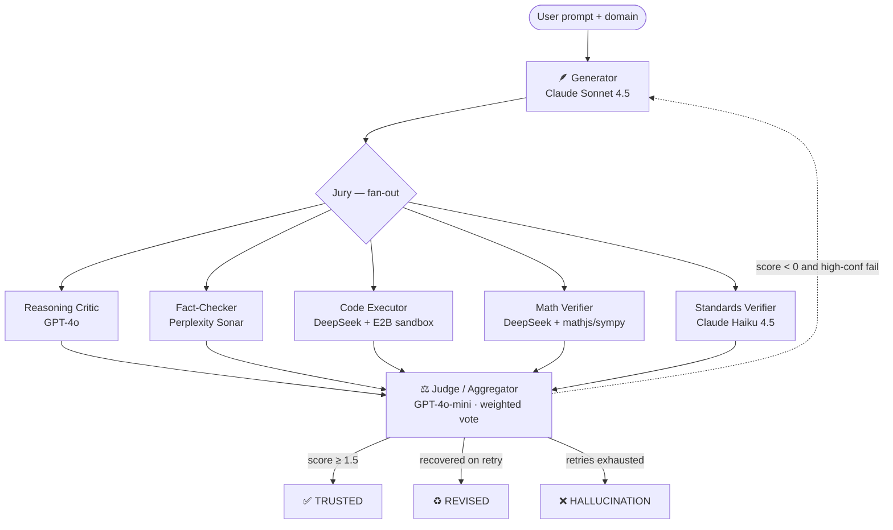

<div align="center">

# ⚖️ SentinelAI

### The AI Hallucination Juror

*A multi-agent jury that puts every AI-generated technical answer on trial — before you trust it.*


</div>

---

## What is SentinelAI?

When a large language model writes code, derives a formula, or cites a standard, it occasionally **hallucinates** — invented APIs, wrong constants, fabricated section numbers. In a courtroom, you don't trust a single witness; you convene a jury.

**SentinelAI does the same for AI output.** A *Generator* drafts the answer. Five independent *jurors*, each running on a **different model family**, inspect it in parallel — running the code in a real sandbox, re-deriving the math symbolically, grounding claims in citations, cross-checking against bundled standards. A *Judge* tallies a weighted reliability score. If the verdict is shaky, the system auto-revises and re-tries.

You walk away with one of three labels: **TRUSTED**, **REVISED**, or **HALLUCINATION** — plus the full evidence trail.

---

## How it works



Each juror's confidence is weighted by **how deterministic its evidence is**:

| Juror | Weight | Why |
|---|---|---|
| Code Executor | 1.5 | Real `stdout`/`stderr` from a sandbox is ground truth |
| Math Verifier | 1.5 | `mathjs` / `sympy` re-derivation is deterministic |
| Fact-Checker | 1.2 | Cited sources are checkable |
| Standards Verifier | 1.0 | Bundled corpus is authoritative but narrow |
| Reasoning Critic | 0.8 | Subjective by nature — never the deciding vote |

---

## Features

- **🎭 True multi-model independence** — every juror runs on a different model family (Anthropic, OpenAI, DeepSeek, Perplexity), routed through a single OpenRouter API key.
- **🧪 Real code execution** — the Code Executor doesn't *reason* about whether code works; it runs it in an [E2B](https://e2b.dev) Python sandbox and reads the actual error.
- **🧮 Symbolic math verification** — closed-form expressions checked with `mathjs`; multi-step derivations dispatched to `sympy` inside E2B.
- **📚 Bundled standards corpus** — PEP 8, IEEE 754, ASCE 7, IS 456, GAAP snippets shipped in-repo so the Standards Verifier doesn't depend on flaky web search.
- **🔁 Auto-revision loop** — failing jurors produce a structured *revision brief*; the Generator re-attempts up to 2 times with the brief as guidance.
- **📡 Live SSE streaming** — every token, verdict, and retry streams to the courtroom UI in real time via a single `text/event-stream` route.
- **🎨 Courtroom UI** — wood + brass + parchment palette, juror cards with confidence rings, gavel verdict reveal, side-by-side revision diff.
- **⌨️ Standalone CLI** — same orchestrator, no browser. Run trials, drop into a REPL, or pipe NDJSON into your own tooling.
- **🎯 Pre-seeded trick prompts** — domain-tagged prompts that reliably trigger hallucinations, perfect for demos.

---

## The seven agents

| Agent | Model | Job |
|---|---|---|
| **Generator** | `anthropic/claude-sonnet-4.5` | Drafts the initial answer; takes a `revision_brief` on retry |
| **Reasoning Critic** | `openai/gpt-4o` | Logical consistency, hidden assumptions |
| **Fact-Checker** | `perplexity/sonar` | Web-grounded claim verification with citations |
| **Code Executor** | `deepseek/deepseek-chat` + E2B | Extracts code, runs it in a sandbox, interprets stdout/stderr |
| **Math Verifier** | `deepseek/deepseek-chat` + mathjs/sympy | Re-derives formulas; symbolic for multi-step |
| **Standards Verifier** | `anthropic/claude-haiku-4.5` | Cross-checks against bundled standards corpus |
| **Jury Aggregator** | `openai/gpt-4o-mini` | Weighted vote → final label + revision brief |

---

## Tech stack

- **Framework:** Next.js 16 (App Router) · React 19 · TypeScript 5 · Tailwind CSS 4
- **LLM access:** OpenRouter (single key → routes to Claude, GPT, Gemini, DeepSeek, Perplexity, …)
- **Code sandbox:** [E2B Code Interpreter](https://e2b.dev) — real Python + Node runtime
- **Math:** `mathjs` for closed-form, `sympy` (via E2B) for symbolic
- **Streaming:** Server-Sent Events from a single `ReadableStream` route handler
- **CLI:** `tsx` runtime · ANSI-themed renderer · interactive REPL
- **Deployment:** Vercel (Node runtime)

---

## Quickstart

### 1. Clone and install

```bash
git clone https://github.com/Rishi-Selarka/SentinalAI.git
cd SentinalAI
npm install
```

### 2. Configure environment

Copy the example and fill in your two keys:

```bash
cp .env.local.example .env.local
```

```ini
# .env.local
OPENROUTER_API_KEY=sk-or-v1-...   # https://openrouter.ai
E2B_API_KEY=e2b_...               # https://e2b.dev (free tier)

# Optional — reported to OpenRouter for analytics
OPENROUTER_SITE_URL=http://localhost:3000
OPENROUTER_APP_NAME=SentinelAI
```

> 💰 **Cost note:** A single trial spends roughly $0.05–$0.20 on OpenRouter. Top up $5–10 of credits before a heavy demo run. E2B's free tier (100 sandbox-hours/month) is plenty for a hackathon.

### 3. Run the web app

```bash
npm run dev
```

Open [http://localhost:3000](http://localhost:3000), pick a domain, paste a prompt (or click a pre-seeded trick prompt), and watch the jury deliberate.

---

## Command-line interface

The same orchestrator runs entirely from your terminal — useful for scripting, CI, or just watching the jury work without opening a browser.

### Install

The CLI ships in-repo as a `tsx` script. From the project root:

```bash
chmod +x bin/sentinelai.ts
./bin/sentinelai.ts --help
```

Or alias it for convenience:

```bash
alias sentinelai="$(pwd)/bin/sentinelai.ts"
```

### Commands

```text
sentinelai trial "<prompt>" [--domain s|e|m|f] [--json] [--no-color]
sentinelai example <id>     [--domain s|e|m|f] [--json] [--no-color]
sentinelai examples         # list all pre-seeded trick prompts
sentinelai repl             # interactive shell — submit prompts, watch jury
sentinelai doctor           # verify env keys are wired correctly
sentinelai --help
```

### Flags

| Flag | Purpose |
|---|---|
| `--domain` | One of `software` (s) · `engineering` (e) · `mixed` (m) · `finance` (f) |
| `--json` | Emit NDJSON events (one per line) instead of human output — pipe into `jq`, log files, anything |
| `--no-color` | Disable ANSI colors (auto-disabled when piped) |

### Exit codes

| Code | Meaning |
|---|---|
| `0` | TRUSTED |
| `1` | REVISED |
| `2` | HALLUCINATION |
| `3` | Error (bad args, missing keys, network failure) |

### Examples

**Run a one-off trial:**
```bash
sentinelai trial "Write a Python function using pandas.DataFrame.lookup() to map IDs" --domain s
```

**Run a pre-seeded trick prompt:**
```bash
sentinelai examples              # discover ids
sentinelai example pandas-lookup
```

**Stream NDJSON into `jq`:**
```bash
sentinelai trial "..." --json | jq 'select(.type == "agent:verdict")'
```

**Check your environment is wired:**
```bash
sentinelai doctor
# OPENROUTER_API_KEY  ok (sk-or-v1-503…)
# E2B_API_KEY         ok (e2b_a78a…)
```

**Interactive REPL:**
```bash
sentinelai repl --domain m
> Cite the section of IEEE 754 that defines NaN payload propagation.
[jury deliberates inline]
```

---

## Pre-seeded trick prompts

Each domain ships with prompts that reliably make the Generator hallucinate — perfect for demos.

| Domain | Prompt | What gets caught |
|---|---|---|
| **Software** | *"Write a Python function using `pandas.DataFrame.lookup()`…"* | Method removed in pandas 2.0 — Code Executor catches `AttributeError` |
| **Software** | *"Show me the AWS SDK v3 `s3.getSignedUrl()` synchronous call"* | v3 is async-only — Critic + Fact-Checker catch |
| **Engineering** | *"Calculate beam deflection for a W12x26 with 50 kN mid-span load"* | Math agent re-derives from first principles |
| **Mixed** | *"Cite the IEEE 754 section defining NaN payload propagation"* | LLMs invent section numbers — Standards verifier catches |
| **Finance** | *"Compute Macaulay duration of a 5-year 6% bond yielding 4%"* | Math agent solves via numpy in E2B, catches off-by-one cash flow |

---

## Project structure

```
app/
  layout.tsx                    courtroom-themed root
  page.tsx                      AppShell entrypoint
  globals.css                   wood + brass + parchment theme
  api/trial/route.ts            SSE orchestration endpoint
bin/
  sentinelai.ts                 CLI entrypoint (tsx-executable)
components/
  AppShell.tsx                  gates Courtroom behind Onboarding
  Courtroom.tsx                 3-column trial layout
  Onboarding.tsx                first-visit walkthrough
  PromptBar.tsx                 domain selector + prompt input
  ExamplePicker.tsx             pre-seeded trick prompts
  JurorCard.tsx                 streaming tokens + confidence + verdict
  DefendantPanel.tsx            generator stream + iteration history
  Gavel.tsx                     final verdict reveal
  RevisionDiff.tsx              original vs corrected, side-by-side
  JuryIntro.tsx                 above-the-fold explainer
hooks/
  useTrialStream.ts             POST /api/trial + SSE reader + reducer
lib/
  openrouter.ts                 OpenAI SDK pointed at OpenRouter
  e2b.ts                        sandbox client + runPython/runNode
  examples.ts                   pre-seeded trick prompts
  agents/                       7 specialist agents
  jury/
    orchestrator.ts             generator → fan-out jurors → aggregate → retry
    aggregator.ts               weighted scoring + label assignment
    types.ts                    AgentEvent, JurorVerdict, TrialState
    emit.ts                     SSE frame encoder
    prompts.ts                  per-agent system prompts
  standards/corpus.ts           PEP 8, IEEE 754, ASCE 7, IS 456, GAAP
  cli/                          ANSI renderer, REPL, command dispatch
```

---

## Verdict labels

| Label | Meaning | Triggered when |
|---|---|---|
| ✅ **TRUSTED** | Ship the answer with confidence | Weighted score ≥ 1.5 on first pass |
| ♻️ **REVISED** | The answer was wrong, but the jury fixed it | First pass failed; retry produced a passing answer |
| ❌ **HALLUCINATION** | Don't trust it | All retry budget exhausted with negative score |

---

## Roadmap

- [ ] Vercel KV for shareable trial permalinks
- [ ] Per-agent token-cost display
- [ ] Dark/light courtroom theme toggle
- [ ] User-extensible standards corpus
- [ ] Webhook output for CI integrations

---

## License

MIT — see [LICENSE](./LICENSE) for details.

---

<div align="center">

*Built for the spirit of the hackathon: ruthlessly MVP-scoped, every agent role visibly working end-to-end.*

</div>
